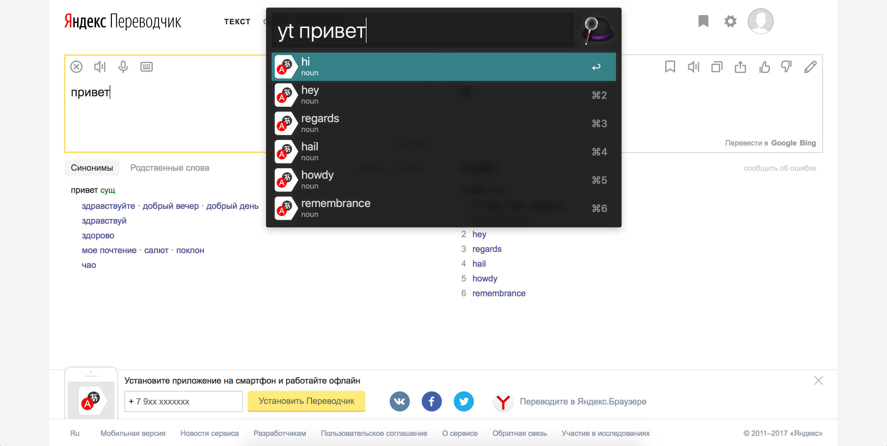

# alfred-yandex-translate

Yandex Translate workflow for Alfred
(powered by [Alfy](https://github.com/sindresorhus/alfy)).




## Install

```shell
$ npm install -g alfred-yandex-translate
```

In addition you need to set your Yandex Translate API keys and Yandex Dictionary API key in the workflow environment variables.

#### Yandex Translate

You can follow an official Getting Started guide to setup your pair of OAuth Token and Folder ID: [English](https://cloud.yandex.com/docs/translate/quickstart), [Russian](https://cloud.yandex.ru/docs/translate/quickstart). Here are the steps how to configure the keys in Alfred:

- Setup your billing account on the [Billing Settings](https://console.cloud.yandex.ru/billing) page. Its status should be `ACTIVE` or `TRIAL_ACTIVE`.
- Get your [OAuth Token](https://cloud.yandex.ru/docs/iam/operations/iam-token/create). Save the generated key.
- Get your [Folder ID](https://cloud.yandex.ru/docs/resource-manager/operations/folder/get-id). You may want to use `default` which should already exist or create a new one. Save the ID.
- In the [Users and Roles Settings](https://console.cloud.yandex.ru/iam) make sure your user has a role `editor` or higher for the folder from the previous step. To see the current role click on the `...` icon and select "Configure Roles".
- Open Alfred preferences.
- Click on the Workflows tab.
- Select the Yandex Translate workflow.
- Click "Configure Workflow...".
- Paste your OAuth Token to the `OAuth Token` field.
- Paste your Folder ID to the `Folder ID` field.

#### Yandex Dictionary

To setup both keys do the following:

- Generate new Yandex Dictionary API key [here](https://tech.yandex.com/keys/get/?service=dict) or use existing one from [My Keys page](https://tech.yandex.com/keys/?service=dict).
- Open Alfred preferences.
- Click on the Workflows tab.
- Select the Yandex Translate workflow.
- Click "Configure Workflow...".
- Paste your Yandex Dictionary API key to the `Dictionary API Key` field.

## Usage

There are two commands available:

- `ytc` - configures translation direction. Shows all available options to select from. Default is `en-ru`.
- `yt` - translates input query using current translation direction. Outputs translation. Use <kbd>Enter</kbd> to copy the translation in the clipboard. Use <kbd>⌘ Cmd</kbd> + <kbd>Enter</kbd> to enlarge the translation text.

You can also setup shortcuts for often used translators. To do this, open the workflow editor and do the following:

- Copy `yt` script filter.
- Paste it and connect with the `Copy to Clipboard` and `Large Type` the same way as original `yt` script filter.
- Open edit dialog for new script filter.
- In the Script field add translation direction you wish to use to the end of the command. For example, `./node_modules/.bin/run-node scripts/translate.js "$1" it-ru`.
- Change Keyword and Placeholder Title to something more meaningful for you.

## License

MIT © [Michael Kalygin](https://about.me/michaelkalygin)
